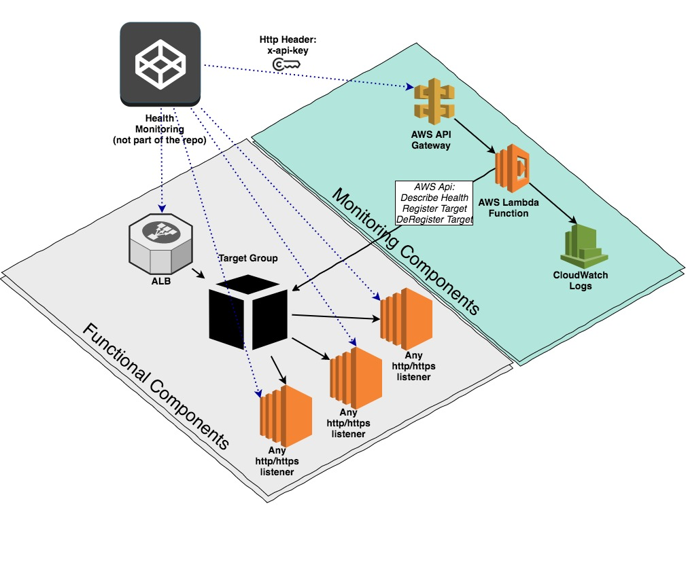

# AWS ALB Api #

# Overview #
Provide restful end-point to register/de-register targets in a ALB Target Group


# End-Points

## List Targets Health
### Request
```
Headers: {'x-api-key': '29ed67a1-0818-442c-9729-6a342998872c'}
GET: /:target-group-arn
```

### Response
```
[
  {
    "Target": {
      "Id": "i-019ebfaf92631c228",
      "Port": 3000,
      "Instance": {
        "InstanceType": "t2.micro",
        "Placement": {
          "AvailabilityZone": "us-east-2a",
          "GroupName": "",
          "Tenancy": "default"
        },
        "State": {
          "Code": 16,
          "Name": "running"
        },
        "SubnetId": "subnet-da1bebb3"
      }
    },
    "HealthCheckPort": "3000",
    "TargetHealth": {
      "State": "healthy"
    }
  },
  {
    "Target": {
      "Id": "i-0b314f9c31a99621c",
      "Port": 3000,
      "Instance": {
        "InstanceType": "t2.micro",
        "Placement": {
          "AvailabilityZone": "us-east-2c",
          "GroupName": "",
          "Tenancy": "default"
        },
        "State": {
          "Code": 16,
          "Name": "running"
        },
        "SubnetId": "subnet-57ffd41d"
        }
      },
    "HealthCheckPort": "3000",
    "TargetHealth": {
      "State": "unhealthy",
      "Reason": "Target.ResponseCodeMismatch",
      "Description": "Health checks failed with these codes: [500]"
    }
  }
]
```

## Deregister Target

### Request with instance-id
```
Header: {'x-api-key': '29ed67a1-0818-442c-9729-6a342998872c'}
DELETE: /:target-group-arn/:instanceId
DELETE: /:target-group-arn/:instanceId/:port
```

### Request with Body
```
Headers: {'x-api-key': '29ed67a1-0818-442c-9729-6a342998872c'}
DELETE: /:target-group-arn
Body: [
  {
    Id: "i-0b314f9c31a99621c",
    Port: "3000"
  },
  {
    Id: "i-019ebfaf92631c228"
  }
]
```

### Response
```
[
  {
    "Target": {
      "Id": "i-0b314f9c31a99621c",
      "Port": 3000
    },
    "TargetHealth": {
      "State": "draining",
      "Reason": "Target.DeregistrationInProgress",
      "Description": "Target deregistration is in progress"
    }
  }
]
```

## Register Target with instance-id
```
Headers: {'x-api-key': '29ed67a1-0818-442c-9729-6a342998872c'}
POST: /:target-group-arn/:instanceId
POST: /:target-group-arn/:instanceId/:port
```

## Register Target with body
```
Headers: {'x-api-key': '29ed67a1-0818-442c-9729-6a342998872c'}
POST: /:target-group-arn
Body: [
  {
    Id: "i-0b314f9c31a99621c",
    Port: "3000"
  },
  {
    Id: "i-019ebfaf92631c228"
  }
]
```

### Response
```
[
  {
    "Target": {
    "Id": "i-0b314f9c31a99621c",
      "Port": 3000
    },
    "TargetHealth": {
      "State": "initial",
      "Reason": "Elb.RegistrationInProgress",
      "Description": "Target registration is in progress"
    }
  }
]
```

# IAM Policies #

## API Gateway Deployment Policy
```
{
  "Version": "2012-10-17",
  "Statement": [
    {
      "Effect": "Allow",
      "Action": [
        "apigateway:*"
      ],
      "Resource": [
        "arn:aws:apigateway:us-east-2::/*/*"
      ]
    }
  ]
}
```

## Lambda ALB Policy ##
```
{
  "Version": "2012-10-17",
  "Statement": [
    {
      "Action": "ec2:Describe*",
      "Effect": "Allow",
      "Resource": "*"
    },
    {
      "Effect": "Allow",
      "Action": "elasticloadbalancing:DescribeTargetHealth*",
      "Resource": "*"
    },
    {
      "Effect": "Allow",
      "Action": "elasticloadbalancing:RegisterTargets*",
      "Resource": "*"
    },
    {
      "Effect": "Allow",
      "Action": "elasticloadbalancing:DeRegisterTargets*",
      "Resource": "*"
    }       
  ]
}
```

## Lambda CloudWatch Policy ##
```
{
  "Version": "2012-10-17",
  "Statement": [
    {
      "Effect": "Allow",
      "Action": [
        "logs:CreateLogGroup",
        "logs:CreateLogStream",
        "logs:PutLogEvents",
        "logs:DescribeLogStreams"
      ],
      "Resource": "arn:aws:logs:*:*:*"
    }
  ]
}
```

## AWS Predefined Policies Required ##
```
CloudWatchLogsFullAccess
CloudWatchEventsFullAccess
```